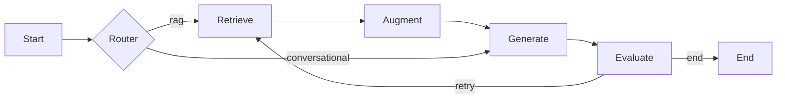
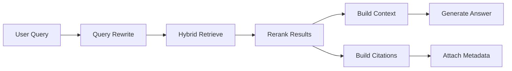

# Diagrams

## Agent DAG Flow

```mermaid
flowchart LR
    A[Start] --> B{Router}
    B -->|rag| C[Retrieve]
    C --> D[Augment]
    D --> E[Generate]
    B -->|conversational| E
    E --> F[Evaluate]
    F -->|retry| C
    F -->|end| G[End]
```

## RAG Flow

```mermaid
flowchart LR
    A[User Query] --> B[Query Rewrite]
    B --> C[Hybrid Retrieve]
    C --> D[Rerank Results]
    D --> E[Build Context]
    E --> F[Generate Answer]
    D --> G[Build Citations]
    G --> H[Attach Metadata]
```
